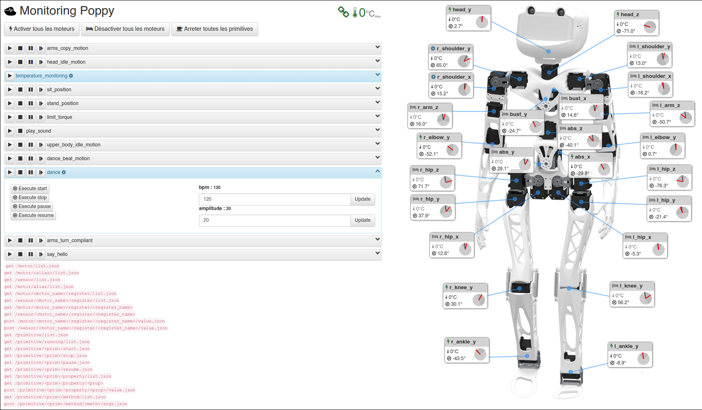

# poppy-monitor

Web tool to monitor and pilot poppy project robot.



It uses Rest API to communicate with the Robot instance. ~~Not compatible, for the moment, with trunk version of pypot, please use the branch 
[bumblebee/pypot](https://github.com/bumblebeefr/pypot).~~ Should now be compatible with the last version of pypot

Allows to watch un realtime temperature, position of the motors, provide a visual and audible alarm when motors are to hot, etc. ...

It also allows you to control the robot:
* Start, stop, execute methods and edit properties of Privitives attached to the Robot instance
* Set the motors compliant/not compliant
* Move motors with the mouse

## How to use it
Clone the project on your computer, or copy it to your odroid (in  /etc/www/web/ if you are using the apache configured with poppy_install script).

The Poppy HTTP Rest service should be running. 
For example in a console:
```
poppy-services --http poppy-humanoid
```
or in a python script:
```
from poppy.creatures import PoppyHumanoid

robot = PoppyHumanoid(use_http=True, start_services=True)
```

Open the index.html file in your browser, click on the red broken link (near the title) and configure the rest api url, for example `http://poppy.local:8080`. If the url is correct and the rest server is running the link will goes green and informations about your robot should appear.


## Licence
GNU GPL v3
